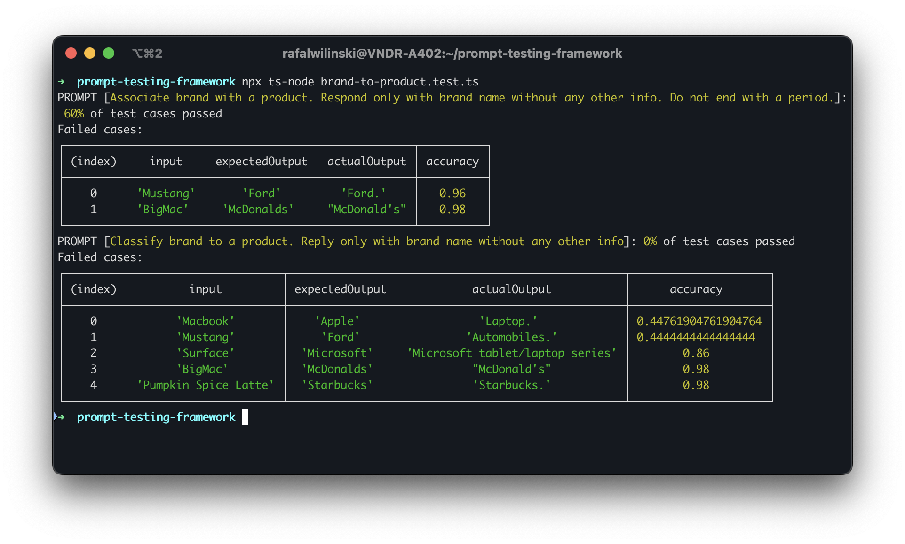

# Prompt Testing Framework

Test how accurate your prompts are. Compare results you expect with the actual results from the OpenAI.



## Installation

```bash
git clone https://github.com/RafalWilinski/prompt-testing-framework
cd prompt-testing-framework
npm install
npx ts-node brand-to-product.test.ts
```

Edit `brand-to-product.test.ts` file or create your own and run it: `npx ts-node your-file.ts`
